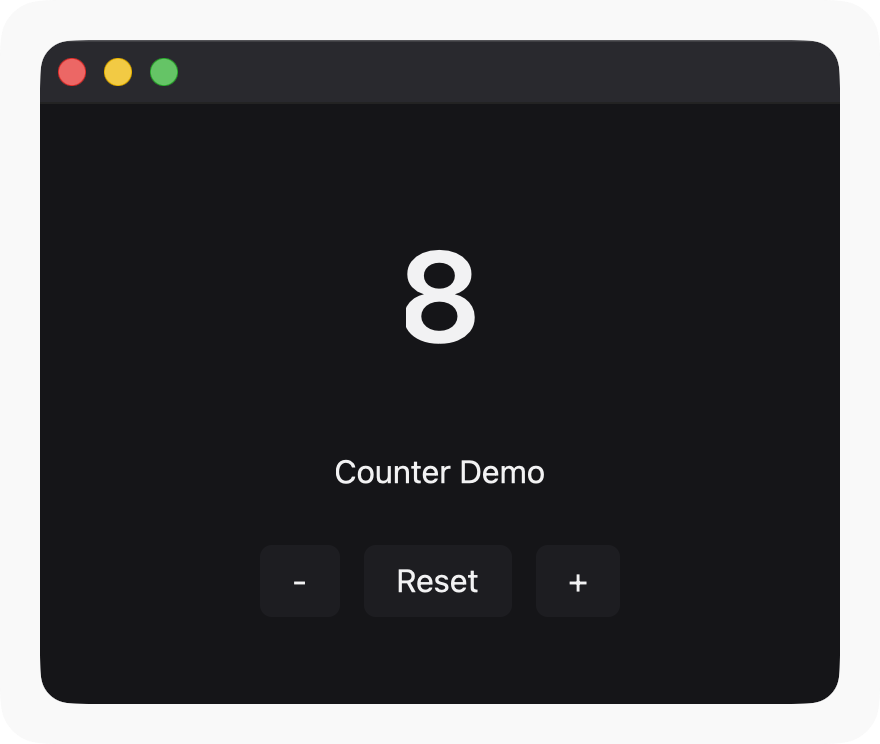
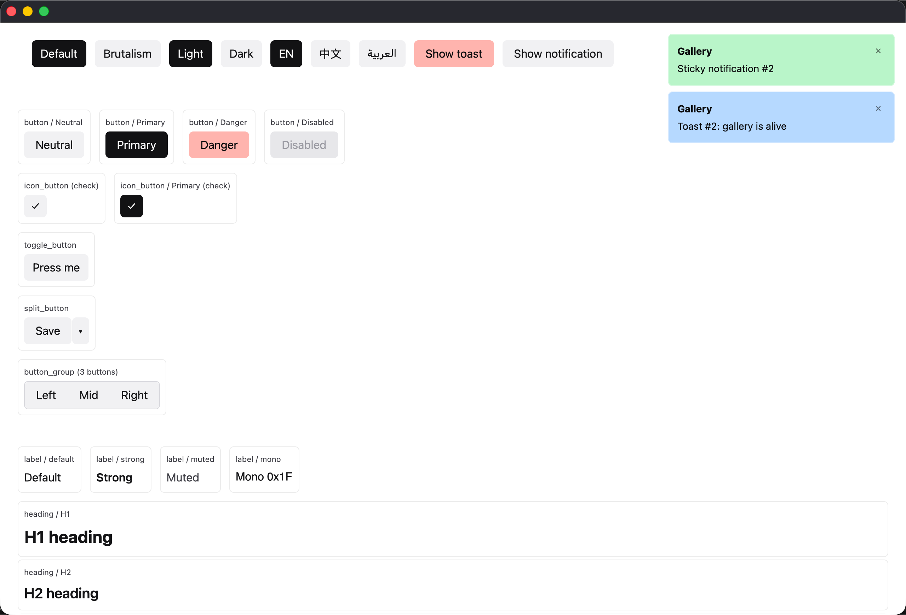
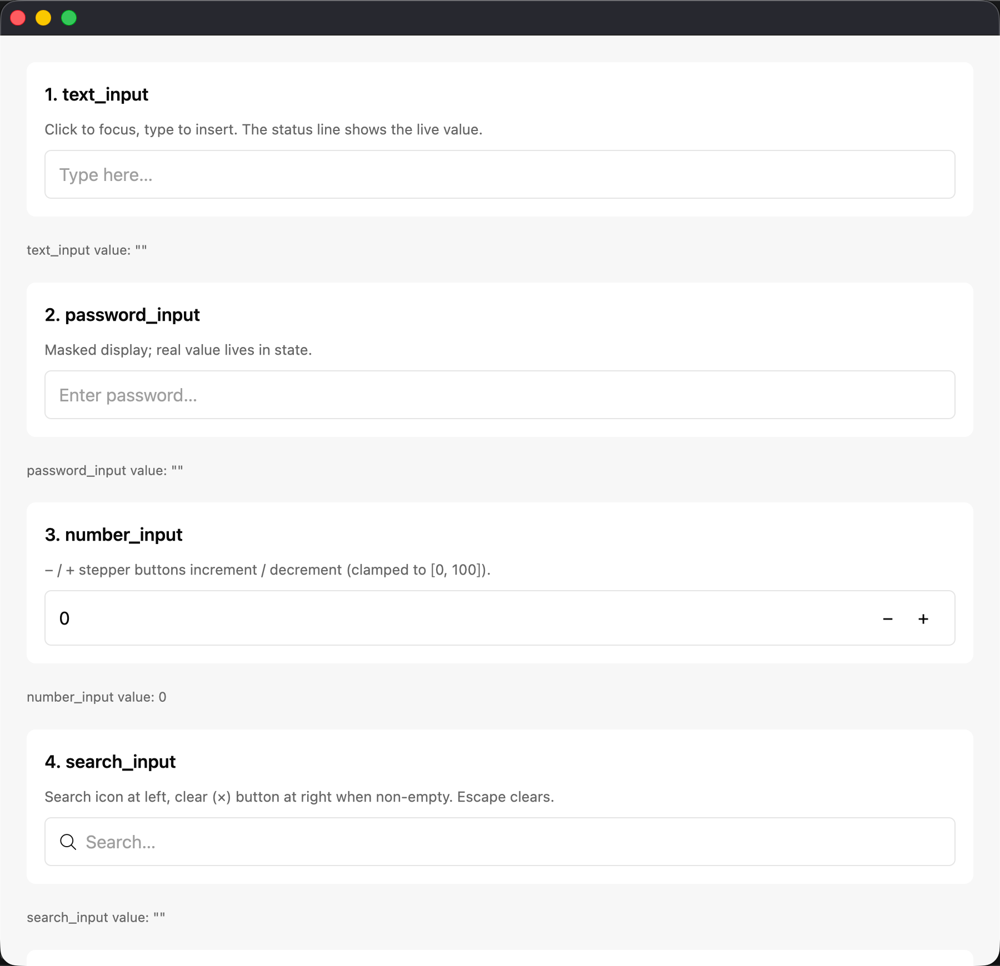
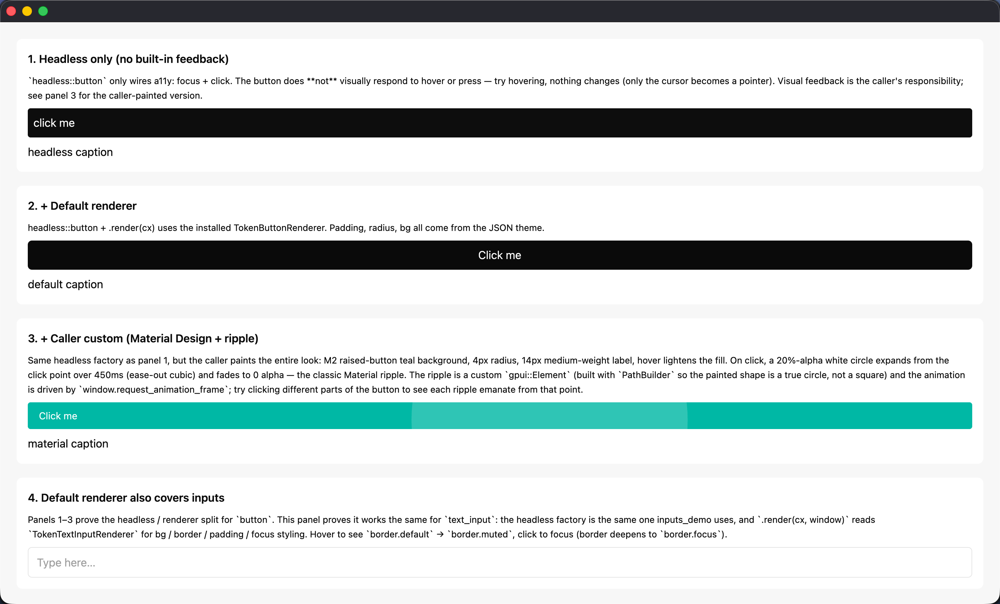
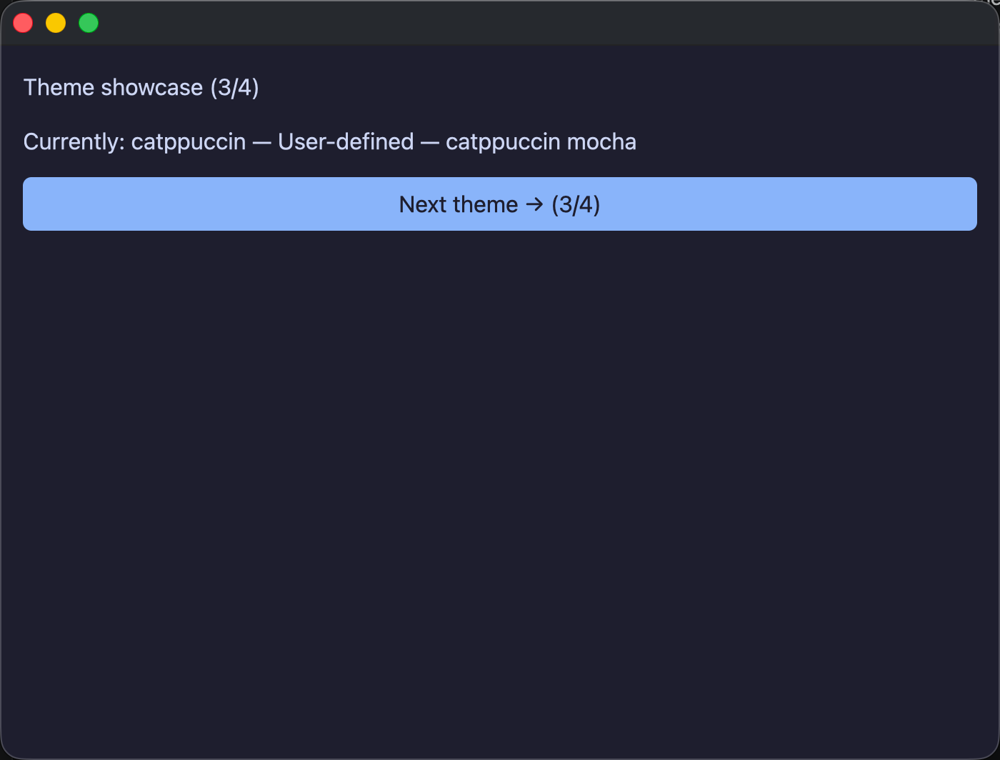
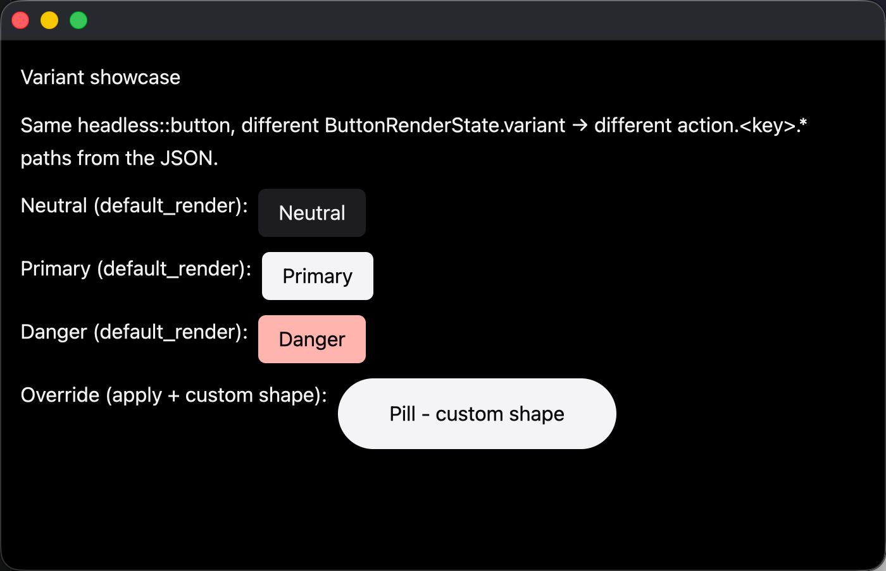
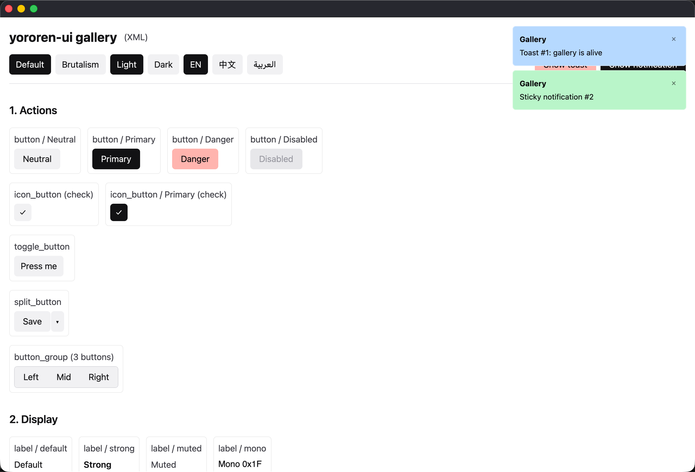
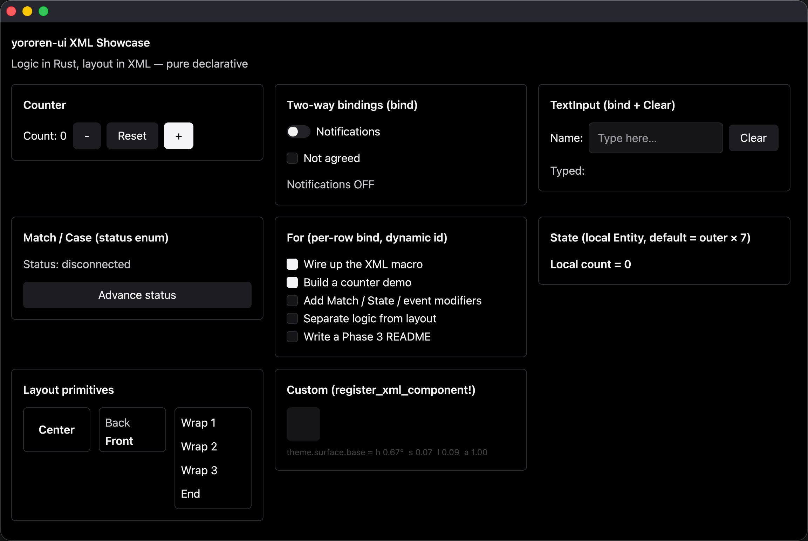
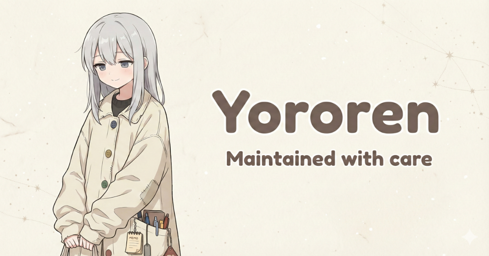

# Yororen UI

<p align="center">
  <strong>中文版</strong> · <a href="README.md">English</a>
</p>

<p align="center">
  
  
  
  
</p>

**Yororen UI** 是一个 headless 优先的 Rust UI 库，基于 [`gpui`](https://github.com/zed-industries/zed)（通过 [`gpui-ce`](https://crates.io/crates/gpui-ce)）构建。按钮不是某种视觉样式，而是一个可聚焦、可点击、可带文本标签和图标的组件；外观由渲染器决定。

```text
主题 JSON  ─▶  渲染器（XxxRenderer）──▶  headless（XxxProps）──▶  gpui-ce
```

- **Headless**（[`yororen-ui-core`](https://crates.io/crates/yororen-ui-core)）—— 数据、状态、a11y、i18n、RTL、动画、资源。不做任何视觉决策。
- **渲染器**（[`yororen-ui-default-renderer`](https://crates.io/crates/yororen-ui-default-renderer) · [`yororen-ui-brutalism-renderer`](https://crates.io/crates/yororen-ui-brutalism-renderer)）—— 负责将 props 转换为样式化的 div。55 个 trait 槽位分别由 `Token*` 或 `Brutal*` 实现；更换渲染器，整套应用的视觉就会一并切换。
- **主题** —— JSON 文件。渲染器按路径（如 `action.primary.bg`）读取；缺失的路径回退到渲染器的默认值。

聚合 crate [`yororen-ui`](https://crates.io/crates/yororen-ui) 重新导出 core + 默认渲染器 + 三个内置 locale，大多数应用只需要这一个依赖。开启 `brutalism` 或 `xml` feature 即可启用备选渲染器或 XML DSL。

---

## 特性

<table>
  <tr>
    <th width="30%">能力</th>
    <th>说明</th>
  </tr>
  <tr>
    <td><strong>55 个组件</strong></td>
    <td>按钮、输入框、徽章、工具提示、模态框、浮层、选择器、列表、虚拟化列表、树、表格等</td>
  </tr>
  <tr>
    <td><strong>三层架构</strong></td>
    <td>headless 原语 + JSON 主题 + 可替换的可视化渲染器（默认 + brutalism）</td>
  </tr>
  <tr>
    <td><strong>JSON 主题</strong></td>
    <td>一次 <code>install()</code> 调用即可在运行时切换主题配色</td>
  </tr>
  <tr>
    <td><strong>动画系统</strong></td>
    <td>每个带状态的复合组件都内置 <code>AnimatedVisibility</code>，并附带预设动画与缓动函数</td>
  </tr>
  <tr>
    <td><strong>国际化</strong></td>
    <td>内置 <code>en</code>、<code>zh-CN</code>、<code>ar</code> 三种 locale；<code>ar</code> 会根据 <code>cx.i18n().text_direction()</code> 自动切换为 RTL 布局</td>
  </tr>
  <tr>
    <td><strong>无障碍</strong></td>
    <td>焦点管理、键盘导航、点击外部关闭、滚动锁定计数、焦点陷阱</td>
  </tr>
  <tr>
    <td><strong>嵌入式资源</strong></td>
    <td>通过 <code>rust-embed</code> 内置 20+ 个 SVG 图标</td>
  </tr>
  <tr>
    <td><strong>通知系统</strong></td>
    <td><code>NotificationCenter</code> 全局对象，支持自动关闭计时、常驻标志与持久化</td>
  </tr>
  <tr>
    <td><strong>可选的 XML DSL</strong></td>
    <td>通过 <code>xml!</code> / <code>xml_file!</code> 宏声明式构建界面</td>
  </tr>
</table>

---

## 快速开始

```rust
use gpui::{App, Application, Bounds, WindowBounds, WindowOptions, px, size};
use yororen_ui::assets::UiAsset;
use yororen_ui::locale_en;
use yororen_ui::renderer;

fn main() {
    let app = Application::new().with_assets(UiAsset);

    app.run(|cx: &mut App| {
        // 1) 渲染器 + 主题 —— 根据系统外观选择 system-light 或 system-dark，
        //    安装全局 Theme，并注册 55 个默认渲染器实现。
        renderer::install(cx, cx.window_appearance());

        // 2) 初始化文本输入的键位映射（幂等）。
        yororen_ui::headless::text_input::init(cx);

        // 3) Locale。
        locale_en::install(cx);

        // 4) 主窗口。
        let options = WindowOptions {
            window_bounds: Some(WindowBounds::Windowed(
                Bounds::centered(None, size(px(800.), px(600.)), cx),
            )),
            ..Default::default()
        };
        cx.open_window(options, |_, cx| cx.new(|_| my_app::MyApp));
    });
}
```

在 <code>Render::render</code> 中：

```rust
use yororen_ui::headless::button::button;
use yororen_ui::headless::label::label;

fn render(&mut self, _w: &mut Window, cx: &mut Context<Self>) -> impl IntoElement {
    div().size_full().flex().items_center().justify_center().gap_2()
        .child(label("count", "0", cx).render(cx))
        .child(button("inc", cx).caption("+").render(cx))
}
```

每个 headless 工厂都同时提供 <code>.apply(div)</code> 与 <code>.render(cx)</code> 两种调用方式：前者仅注入无障碍属性，后者则通过已注册的渲染器渲染完整视觉。文本输入的 <code>.render(cx, window)</code> 为双参数调用，并会在 <code>window</code> 上注册 IME 处理器。

<details>
<summary><strong>切换渲染器或主题（可选）</strong></summary>

### Brutalism 渲染器

```rust
use yororen_ui::brutalism_renderer;

brutalism_renderer::install(cx);   // 直角、硬阴影、等宽字体
```

### 自定义 JSON 主题

```rust
use yororen_ui_default_renderer::{Theme, install_with};

const MY_THEME: &str = include_str!("../themes/my-brand.json");
install_with(cx, Theme::from_json(MY_THEME).expect("valid JSON"));
```

### 运行时主题切换

在 <code>Render</code> 实现中调用 <code>yororen_ui::theme::install(cx, new_theme)</code>——可在每帧渲染时调用，也可在用户切换主题时调用。调用是幂等且廉价的。

```rust
impl Render for MyApp {
    fn render(&mut self, _w: &mut Window, cx: &mut Context<Self>) -> impl IntoElement {
        yororen_ui::theme::install(cx, self.current_theme());
        // … 渲染剩余部分 …
    }
}
```

</details>

---

## 示例应用

<!-- ====================================================================== -->
<!-- 重新生成截图的方法：运行示例并截屏保存到 screenshots/<name>.png。   -->
<!-- 文件名约定见 screenshots/README.md。                                  -->
<!-- ====================================================================== -->

<table>
  <tr>
    <td width="50%" valign="top">

**`counter`** —— 最小启动模板：仅使用一个全局 <code>Entity&lt;T&gt;</code> 和三个按钮。

<p></p>

```
cargo run -p counter-demo
```

</td>
    <td width="50%" valign="top">

**`gallery_demo`** —— 全面的组件参考示例：涵盖全部组件、主题切换、i18n、通知与虚拟化列表。

<p></p>

```
cargo run -p gallery-demo
```

</td>
  </tr>
  <tr>
    <td width="50%" valign="top">

**`inputs_demo`** —— 全套七个文本输入，采用 <code>cx.entity().clone()</code> 模式。处理 <kbd>Tab</kbd> / <kbd>Enter</kbd> / <kbd>Esc</kbd> / <kbd>⌘V</kbd>。

<p></p>

```
cargo run -p inputs-demo
```

</td>
    <td width="50%" valign="top">

**`layers_demo`** —— 三种渲染路径并排展示，外加手写的 Material 涟漪动画。

<p></p>

```
cargo run -p layers-demo
```

</td>
  </tr>
  <tr>
    <td width="50%" valign="top">

**`theme_showcase`** —— 通过 <code>theme::install</code> 在每帧渲染时切换主题，循环展示四种主题。

<p></p>

```
cargo run -p theme-showcase-demo
```

</td>
    <td width="50%" valign="top">

**`variant_showcase`** —— <code>ActionVariantKind</code> 视觉对比（<code>Neutral</code> / <code>Primary</code> / <code>Danger</code>），使用同一个 <code>headless::button</code> 工厂。

<p></p>

```
cargo run -p variant-showcase-demo
```

</td>
  </tr>
  <tr>
    <td width="50%" valign="top">

**`gallery_xml`** —— 使用 XML DSL 重新实现的 gallery。

<p></p>

```
cargo run -p gallery-xml-demo
```

</td>
    <td width="50%" valign="top">

**`showcase_xml`** —— 小规模的 XML DSL 基础测试。

<p></p>

```
cargo run -p showcase-xml-demo
```

</td>
  </tr>
</table>

---

## 包含内容

<table>
  <tr>
    <th>Crate</th>
    <th>角色</th>
  </tr>
  <tr>
    <td><code>yororen-ui-core</code></td>
    <td>Headless 原语、主题 JSON 访问、i18n、a11y、RTL、动画、资源、通知中心</td>
  </tr>
  <tr>
    <td><code>yororen-ui-default-renderer</code></td>
    <td>55 个 <code>TokenXxxRenderer</code> 默认实现 + 内置 <code>system-light.json</code> / <code>system-dark.json</code> 主题 + <code>renderer::install</code> 引导函数</td>
  </tr>
  <tr>
    <td><code>yororen-ui-brutalism-renderer</code><br><sub><em>（可选，feature <code>brutalism</code>）</em></sub></td>
    <td>直角、粗黑边框、硬偏移阴影、等宽字体</td>
  </tr>
  <tr>
    <td><code>yororen-ui-xml</code> + <code>yororen-ui-xml-macro</code><br><sub><em>（可选，feature <code>xml</code>，默认开启）</em></sub></td>
    <td>XML DSL：<code>xml!</code>、<code>xml_file!</code>、<code>register_xml_component!</code>、<code>bind</code></td>
  </tr>
  <tr>
    <td><code>yororen-ui-locale-{en, zh-CN, ar}</code></td>
    <td>内置 JSON 翻译目录</td>
  </tr>
  <tr>
    <td><code>yororen-ui</code><br><sub><em>（聚合 crate）</em></sub></td>
    <td>重新导出上述所有内容，大多数应用只需要这一个</td>
  </tr>
</table>

### 三层架构

```text
主题 JSON  ─▶  渲染器（XxxRenderer）──▶  headless（XxxProps）──▶  gpui-ce
```

- **Headless** —— 数据 + 控制 + a11y。无视觉。
- **渲染器** —— 每个组件一个 trait，读取主题并生成样式化 div。
- **主题** —— 一个 <code>serde_json::Value</code>，可在运行时切换。

55 个组件标记（<code>yororen-ui-core::renderer::markers</code>）是全局 <code>RendererRegistry</code> 的键。默认渲染器和 brutalism 渲染器各实现全部 55 个 trait 槽位。

自定义渲染器只需要实现 55 个 <code>XxxRenderer</code> trait——完全不需要触碰 headless 层。

---

## 安装

<details>
<summary><strong>从 crates.io 使用（推荐）</strong></summary>

```toml
[dependencies]
yororen_ui = "0.3"
```

<code>xml</code> feature 默认开启，<code>xml!</code> / <code>xml_file!</code> 开箱即用。如需关闭：

```toml
[dependencies]
yororen_ui = { version = "0.3", default-features = false }
```

按需启用 feature：

```toml
[dependencies]
yororen_ui = { version = "0.3", default-features = false, features = ["xml", "brutalism"] }
```

</details>

<details>
<summary><strong>从 GitHub 使用（最新开发版）</strong></summary>

```toml
[dependencies]
yororen_ui = { git = "https://github.com/MeowLynxSea/yororen-ui.git", tag = "v0.3.0" }
```

</details>

<details>
<summary><strong>从本地路径使用（开发时）</strong></summary>

```toml
[dependencies]
yororen_ui = { path = "../yororen-ui" }
```

</details>

<details>
<summary><strong><code>gpui</code> 依赖</strong></summary>

<code>gpui</code> 通过 crates.io 上的 <a href="https://crates.io/crates/gpui-ce"><code>gpui-ce</code></a> crate 提供。请确保您的应用程序使用兼容的版本：

```toml
[dependencies]
gpui = { package = "gpui-ce", version = "0.3" }
```

在本仓库中，<code>gpui-ce</code> 已在 <code>Cargo.toml</code> 中指定。

</details>

---

## 环境要求

- **Rust edition：** 2024
- **平台：** macOS、Linux、Windows（与 <code>gpui-ce</code> 支持的范围一致）

---

## 许可证

采用 **Apache License, Version 2.0** 授权。本项目基于 <code>gpui</code>（Zed Industries）构建，同样采用 Apache-2.0。归属详情请参见 <code>LICENSE</code> 和 <code>NOTICE</code>。

---

## 贡献

欢迎提交 Issue 和 PR。修改视觉效果时：

- 请附上截图或简短录屏
- 代码请保持 <code>rustfmt</code> 格式

---

## Wiki

参见 [Yororen UI Wiki](https://github.com/MeowLynxSea/yororen-ui/wiki) 获取详细指南、配方和组件参考。

---

## Star History

<a href="https://www.star-history.com/#MeowLynxSea/yororen-ui&type=date&legend=top-left">
  
</a>

---

## 由 Yororen 维护

<p align="center">
  
</p>